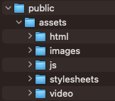
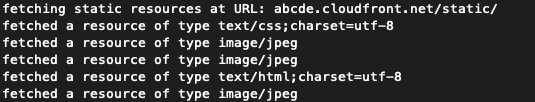

# cdn_load_testing_toolkit
This repo provides two tools that allow users to test their CDN configurations: 
1. Small SFS: an economical static file server 
2. Request Monster: a javascript program that issues pseudo-random requests for those static files.

# what does the toolkit do?
- Small SFS is a static file server that can be hosted on a VPS behind a CDN. It comes pre-loaded with thousands of small files that can be used to test CDN performance.

- Request Monster issues requests for static resources at a configurable rate

- When used together, these two repos simulate traffic to the CDN, and can be used for load testing, as well as debugging and optimization of the CDN.

# installation

Installation notes are located in the readme for both tools. small sfs is designed to run on a VPS whereas request monster can be run from your local development environment.